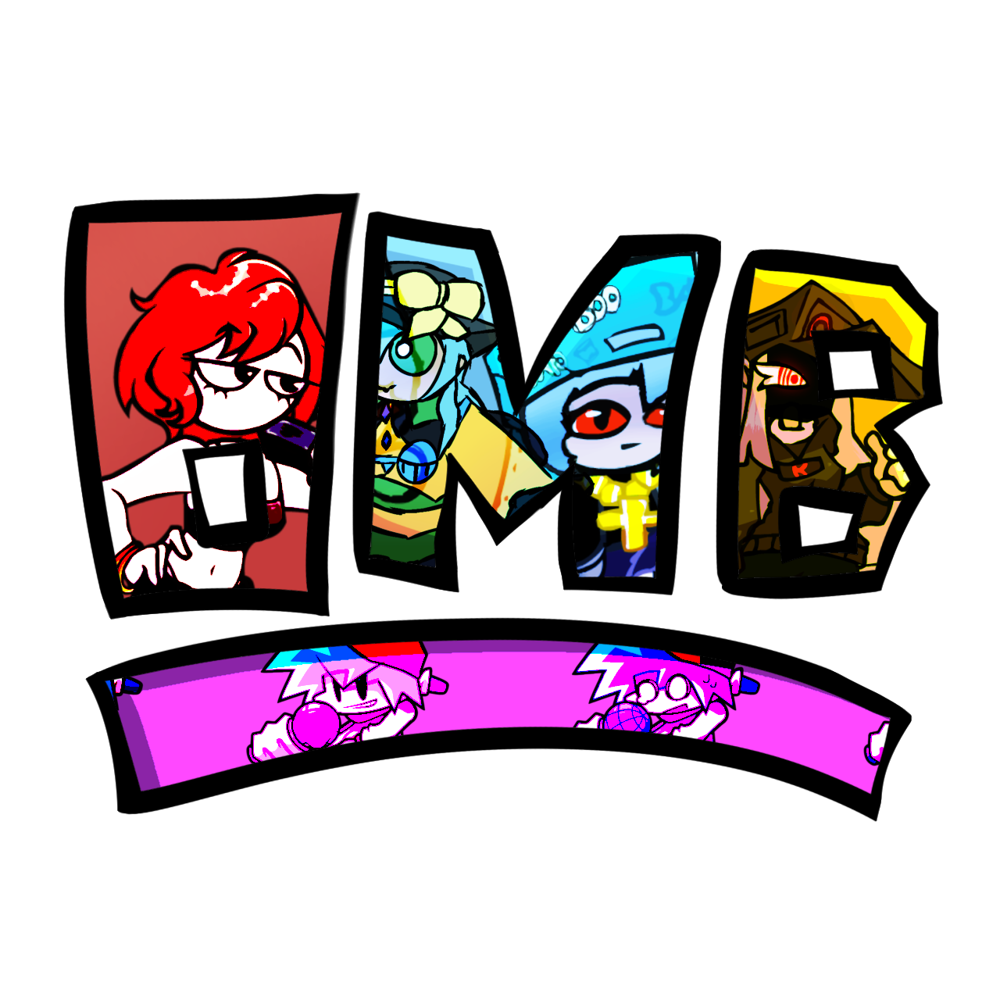

<!-- Thanks soushimiya for this README template! -->
<!-- Improved compatibility of back to top link: See: https://github.com/othneildrew/Best-README-Template/pull/73 -->

<!--
*** Thanks for checking out the Best-README-Template. If you have a suggestion
*** that would make this better, please fork the repo and create a pull request
*** or simply open an issue with the tag "enhancement".
*** Don't forget to give the project a star!
*** Thanks again! Now go create something AMAZING! :D
-->

<!-- PROJECT SHIELDS -->
[![Contributors][contributors-shield]][contributors-url]
[![Forks][forks-shield]][forks-url]
[![Stargazers][stars-shield]][stars-url]
[![Issues][issues-shield]][issues-url]
[![MIT License][license-shield]][license-url]

<!-- PROJECT LOGO -->
 

  

<h3 align="center">On my Block P-slice version</h3>

  

    un mod todo culero usando P-slice por que V-slice da vergal de lag jasjajs
   

#### Hecho con 

<!-- ABOUT THE PROJECT -->
## Acerca del mod
Lore en
  <a href="https://drive.google.com/drive/folders/1cfUm_IAzkGjProFM4YElxSJMsN6ko2Le?usp=drive_link"> Puede ser actualizado </a>

<!-- LICENSE -->
## Licensia (no se como sirve esto atte Bin)

Distributed under the Apache License 2.0. See [Licence](https://github.com/Psych-Slice/blob/P-Slice/master/LICENSE) for more information.

(<a href="#readme-top">back to top</a>)

<!-- MARKDOWN LINKS & IMAGES -->
<!-- https://www.markdownguide.org/basic-syntax/#reference-style-links -->
[contributors-shield]: https://img.shields.io/github/contributors/Psych-Slice/P-Slice.svg?style=for-the-badge
[contributors-url]: https://github.com/Psych-Slice/P-Slice/graphs/contributors
[forks-shield]: https://img.shields.io/github/forks/Psych-Slice/P-Slice.svg?style=for-the-badge
[forks-url]: https://github.com/Psych-Slice/P-Slice/forks
[https://github.com/Psych-Slice/P-Slice/forks]: https://github.com/Psych-Slice/P-Slice/network/members
[stars-shield]: https://img.shields.io/github/stars/Psych-Slice/P-Slice.svg?style=for-the-badge
[stars-url]: https://github.com/Psych-Slice/P-Slice/stargazers
[issues-shield]: https://img.shields.io/github/issues/Psych-Slice/P-Slice.svg?style=for-the-badge
[issues-url]: https://github.com/Psych-Slice/P-Slice/issues
[license-shield]: https://img.shields.io/github/license/Psych-Slice/P-Slice.svg?style=for-the-badge
[license-url]: https://github.com/Psych-Slice/P-Slice/blob/master/LICENSE.txt!
